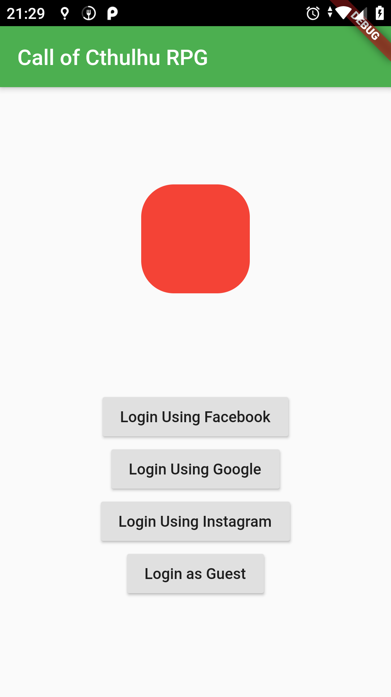
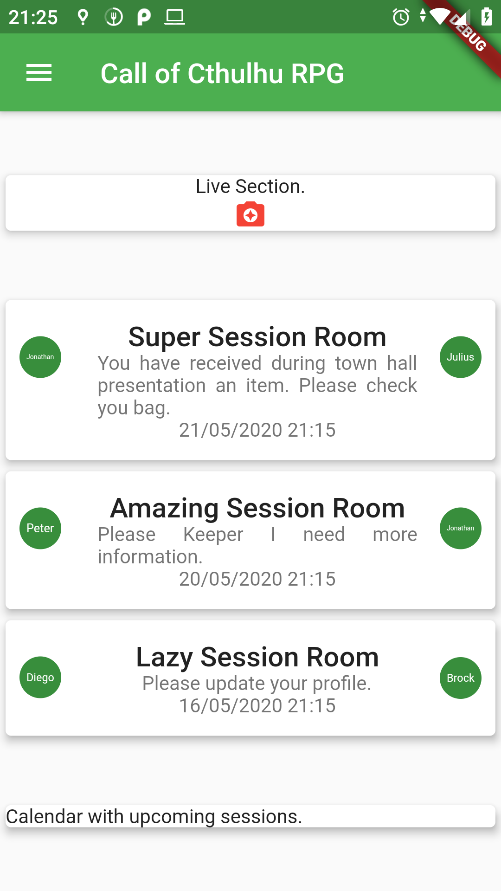
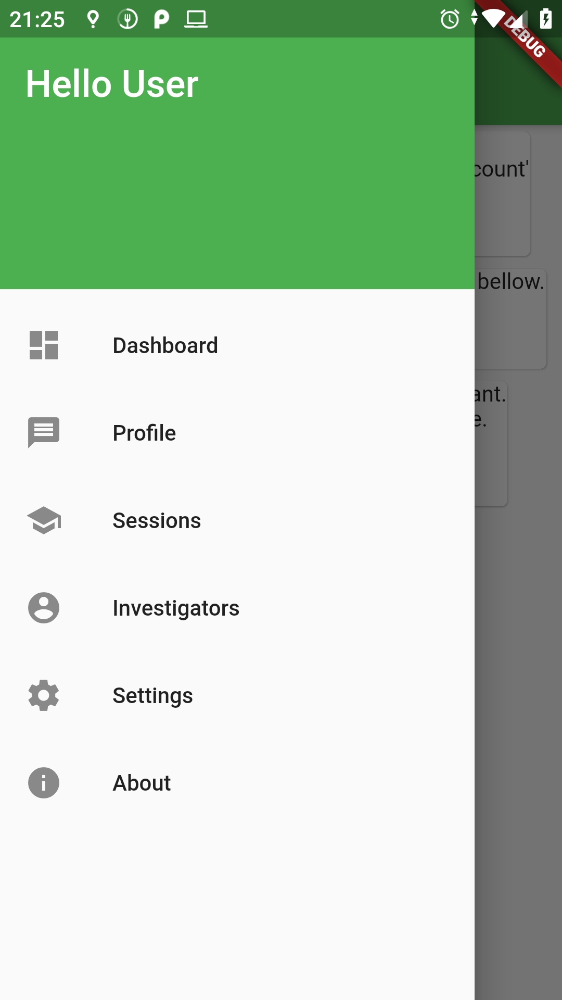
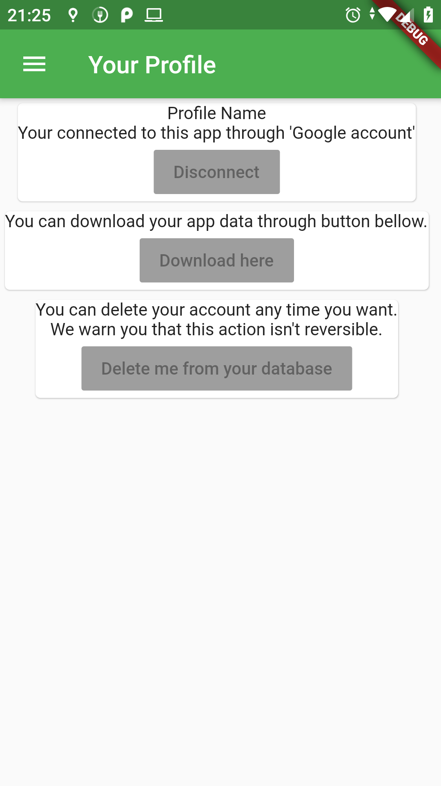
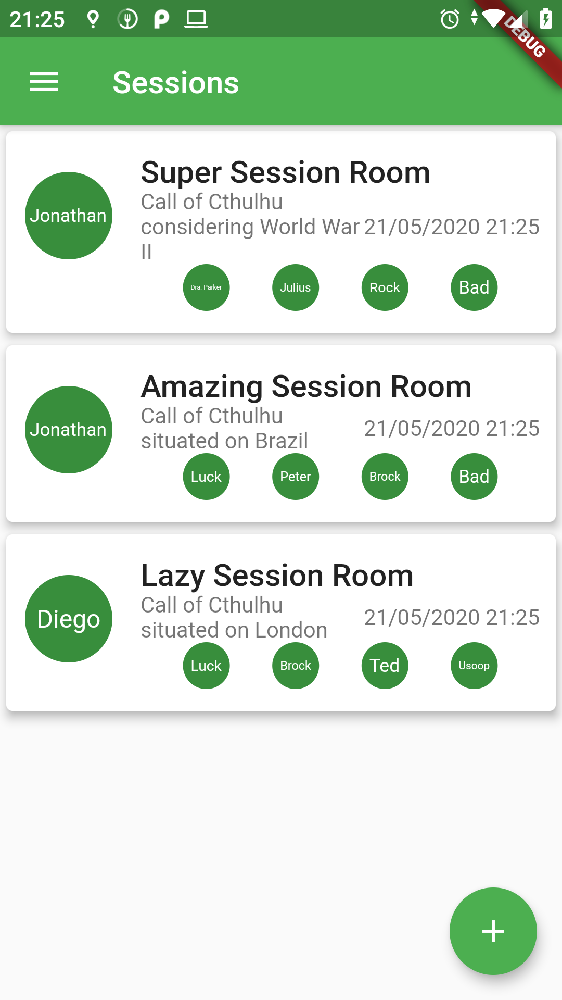
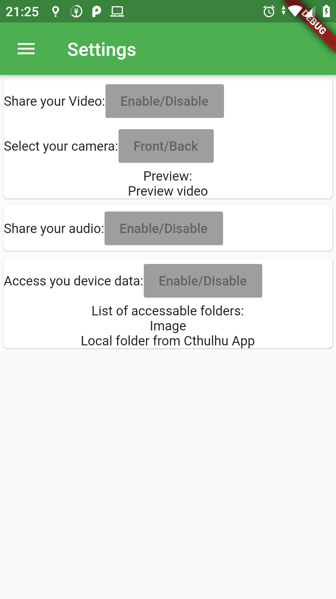
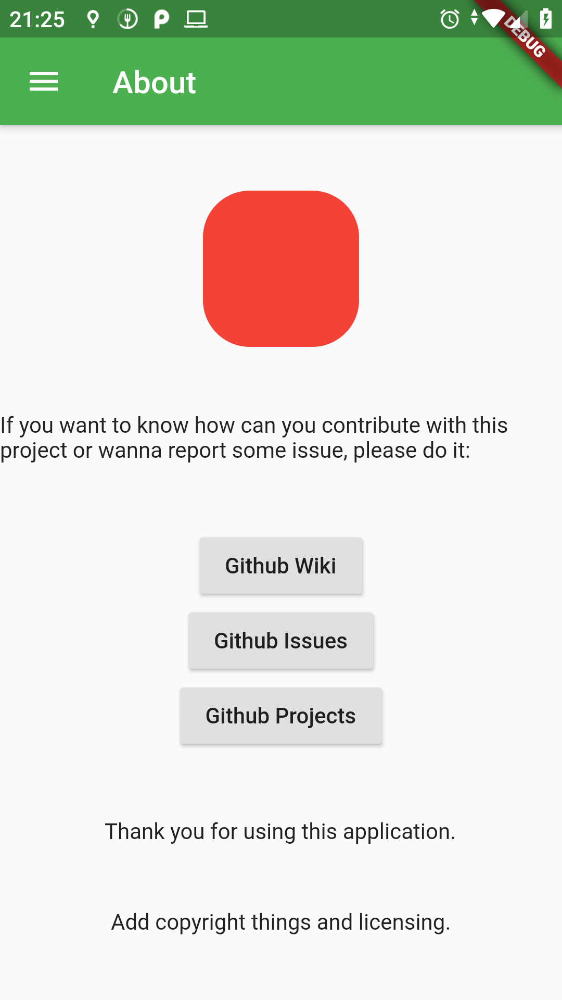

# Call of Cthulhu RPG webapp created using Flutter and Flask

This project will be based on [Chaosium: Call of Cthulhu RPG](https://www.chaosium.com/call-of-cthulhu-rpg/) official documentation. All RPG content is reserved to them.

## Project information

Please use [Github: Projects](https://github.com/jsperafico/call_cthulhu/projects) to see our kanban progression.

If you find any issues, please report at [Github: Issues](https://github.com/jsperafico/call_cthulhu/issues),

Specific information about how to use the webapp, consult [Github: Wiki](https://github.com/jsperafico/call_cthulhu/wiki).

## How to contribute with this project?

Please, clone this repository on you machine.
Once that done, is highly recommeded to read [Flutter DevContainer Documentation](docker/README.md)

## Screenshots of the App

